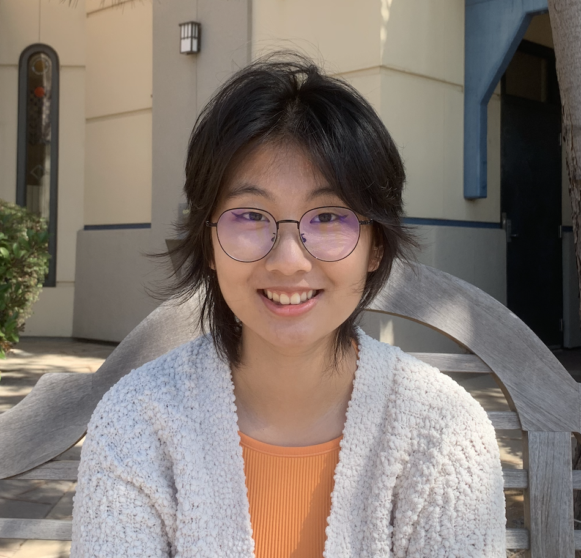

# Ruoxuan Li #

## Me As a Programmer
I am an undergraduate student with a major in *cognitive science with a specialization with machine learning and neural network* and a minor in *computer science* at the __University of California, San Diego__. I have experience as a tutor in both the fields of data science and computer science. My primary coding language is __Python__, and I am familiar with writing code in __Java, C++,__ and __C__. I believe that the purpose of programing or building any technologies is to address the needs of people, so it is important to identify the needs of different groups. My area of interest focuses on analyzing data and using the data to create opportunities and better outcomes for people who create the source of data.  
The areas that I have dedicated to including the following:
- `Computing Education`
- `Supervised Machine Learning`
- `Data analysis`  

Currently I am interested in exploring the field of HCI and hope to apply my interdisplinary knowledge to build technologies that better address people's needs. I am also hoping to learn about front-end and back-end development and would love to get involved in real-world projects.
[Click here to learn more about me as a Programmer.](https://www.linkedin.com/in/ruoxuan-li-b5386b66/)  

## My Personal Life
I enjoy outdoor activities such as __hiking__ and __birding__. I am also an __amateur photographer__ and enjoys taking photos of birds and other wildlife. Here is one photo of *horned lark* that I took while I was on the shelter island in San Diego ([link to photo](405EB268-5D09-49C5-924A-290BB1B58020.jpeg)). I have great ethusiasm towards all kinds of __animals__ and have kept and am keeping many different species of animals as pets: my border collie *Horus*, my three fancy mice *Eleven*, *Seven*, and *Puff*, and my hamster *Cactus*. 
I also enjoy __reading__. My favorite author is the German author __Hermann Hesse__. My favorite book of his is __*Siddartha*__. His quotes from the book have been inspiring me to learn about myself and help me explore the meaning of life. Below is one of my favorite quotes from him:
>“I have had to experience so much stupidity, so many vices, so much error, so much nausea, disillusionment and sorrow, just in order to become a child again and begin anew. I had to experience despair, I had to sink to the greatest mental depths, to thoughts of suicide, in order to experience grace.” 

I have set up a few goals for me to accomplish before I graduate, here is a list:
- [ ] get my driver's liscence
- [x] become a researcher
- [x] get to know amazing people
- [x] become a tutor
- [ ] receive an internship offer
- [ ] publish a paper 
__...__  

***To me, living in the world is like an adventure for a lifetime and I would love to seek possibilities and explore the amazing things surround me!***
